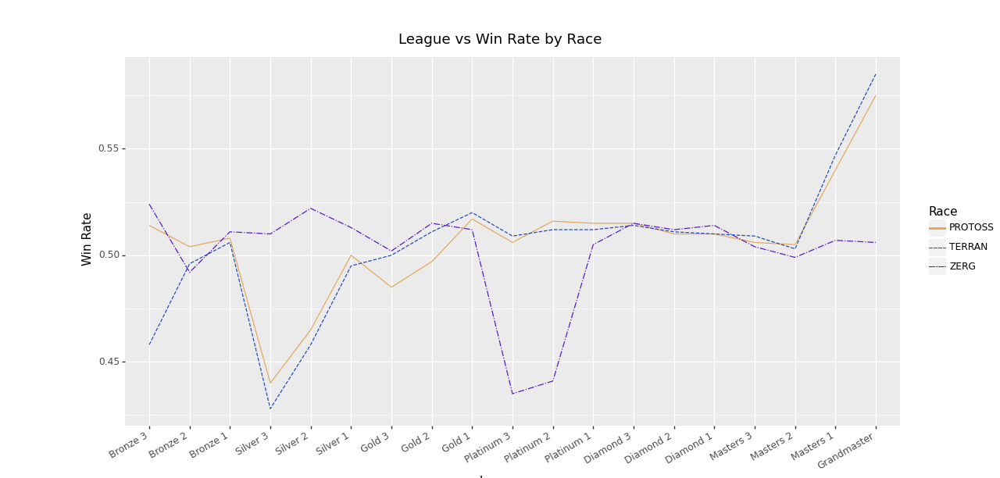

# Starcraft 2: Player and matches data analysis

## Is the game well-balanced in its mechanics? 

Another question of interest is "Is the game well balanced in its mechanics? " In this case, game balance refers to the situation where there doesn't exist a dominant race that outperforms the rest because it's easier to play that race or it's uplifted and become stronger.

### ** MMR (Matchmaking rating) distribution by in-game race:**
   

This figure gives an overall picture of the MMR distribution of each race. Higher values of MMR tend to correspond to better performances. In Figure 1, the blue, yellow, and purple dotted lines show the mean values of MMR of TERRAN, PROTOSS, and ZERG respectively. This means that on average, ZERG players tend to have the best performance among the three races, and TERRAN is likely to be the one that underperforms. However, there are several problems with using MMR value as an indication of performance and skill. For instance, there exist some smurfs who specifically create or buy low-level accounts to play against lower-ranked players. In this case, their MMR would underestimate their performance and skill level. Moreover, MMR value could also be manipulated via hacking. As a result, it would be more appropriate to use win rate as an indicator of performance. 
###  **Race-wise win rates by league**
   

This figure shows the win rate of each league by race. As the Figure illustrates, the performances of PROTOSS and TERRAN players are very similar across all leagues except for Bronze 3, in which PROTOSS tends to outperform TERRAN. Whereas the win rate of ZERG players is very different from its two counterparts. In particular, the significant drop in win rate occurs in much higher leagues, Platinum 3 and Platinum 2, than the cases of PROTOSS and TERRAN whose slumps both appear in Silver 3. This is consistent with the fact that ZERG has very different mechanics than the other two races.  Therefore, in lower-level leagues, ZERG tends to win more often, whereas, in middle and upper leagues, PROTOSS and TERRAN are more likely to outperform ZERG. This heterogeneity makes us wonder: when playing against each other, is there one race that particularly outperforms the other? 
###  **Matchup-wise win rates by league**

As shown by the figure above, it turned out that in lower-level leagues, from Bronze 3 to Gold 2, ZERG significantly outperforms TERRAN, and the situation is similar for PROTOSS except for Bronze 3. However, when it comes to the upper leagues, ZERG players generally underperform when they play against the other races, except for the case where ZERG plays against PROTOSS in Masters 2 league. It is also worth noting that while the overall win rates of PROTOSS and TERRAN are similar in the upper leagues from Platinum to Grandmaster, when playing against each other, TERRAN tends to win more often than PROTOSS.
