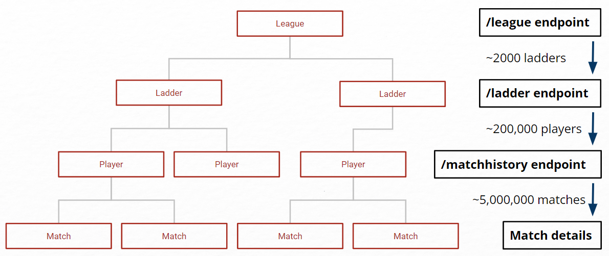
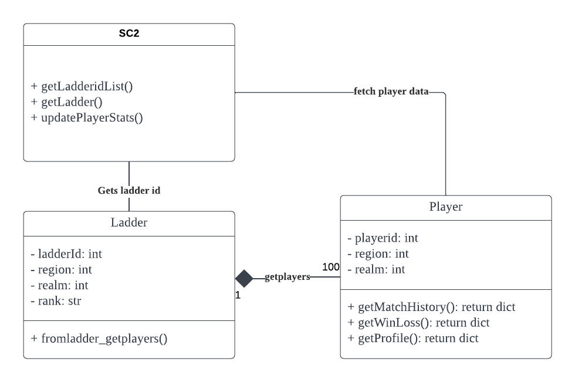
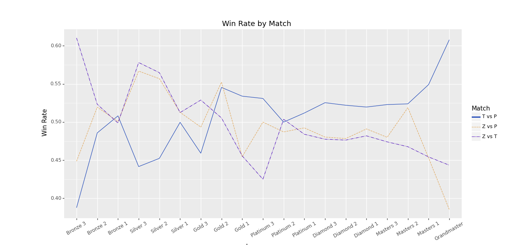
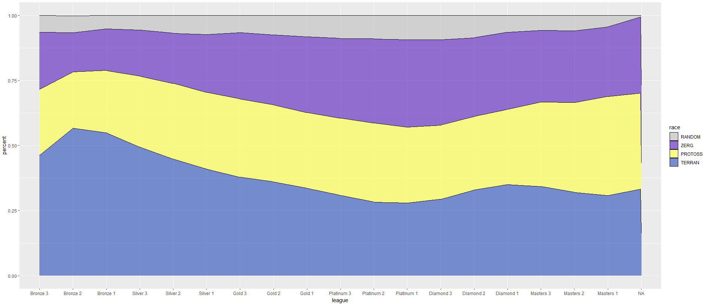

<center>

# Starcraft-Dashboard: Player and matches data analysis of starcraft II

## 🟢Check out our web application [here](https://sc2dashboard.herokuapp.com)!🟢

</center>

<p style='text-align:center'>

</p>

# Motivation

## What is Starcraft II?
Starcraft II is a real-time military science fiction video game, developed by Blizzard Entertainment for PC and Mac. People win by destroying all of their opponents' buildings. 


## Initial Goals
What made us interested in this? We embarked on the project with some questions in mind:
* Why are some players ranked higher than others?
* How exactly does practicing more games affect players' skill levels?
* What is the association between a player's short and long term performance?
* Is the game well-balanced in its mechanics? E.g. Does one race win more often than other races?

Of course, these are simply some of the questions that spurred us to take up this project. We acknowledge that not all these questions can be answered by our data analysis, and the research path we took did not strictly follow these. However, this was what guided us initially.

## How does Starcraft II work?

Players play in matches against one another. These matches take place in 3 servers - US, EU and Korea. Players can choose from different 3 different character Races - ZERG, PROTOSS and TERRAN (or they can choose a RANDOM race), each race with different characteristics hence strengths and weaknesses.

Players are put into different leagues based on their skill level. There are a total of 19 different leagues (Bronze 1/2/3, Silver 1/2/3, Gold 1/2/3, Platinum 1/2/3, Diamond 1/2/3, Master 1/2/3, Grandmaster). Their skill levels are given by a scoring system called Matchmaking Rating (abbreviated as MMR). Based on their performance, their MMR score changes and they can move up and down leagues.


# Data collection
We want to collect player and match data of all players in the current ladder season. Activition Blizzard has player profile data and match history data stored on their servers. We are able to access those raw data using the [Blizzard Battle.net API](https://develop.battle.net/documentation/starcraft-2/community-apis) as our data source. 

## Using the API
In their API, Blizzard provides a variety of metadata such as player achievements and in-game rewards. We want to access specifically the data on player performance (e.g. Wins/losses, matchmaking rating, rank) as well as their match history. 

The data we want comes from a variety of API endpoints. Some important ones are the `legacy/getLeagueData` endpoint, `/Ladder` endpoint, as well as the `/getmatchhistory` endpoint.


The figure above shows the basic structure of the Battle.net API endpoints for Starcraft II. Note that unlike on the figure, going down each branch in the data results in increase in data entries by an order of magnitude of considerable larger. To begin, we make a request to the `legacy/getLeagueData` endpoint which returns the `ladderid` of all active ladders in the current season. This should give about 2000 unique `ladderid`, which each contain around 100 players.  Then we make a request to the `ladder` endpoint using `ladderid` to obtain the list of `playerid` within the ladder. By this point, we should be able to track the profile of around 200,000 players with all three servers (US, EU, and KR) combined. In the end, a player's `playerid` is used to request the player's profile and their match history. The `matchhistory` endpoint stores the 25 most recent matches of a player regardless of when the matches were played. The resulting data should consist of around 5,000,000 matches for 200,000 players.

## Facing the API side problems

An obvious issue that arises is the complications that come with making tremendous amounts of API calls in our code. One factor that feed into this issue is the request quota, where single clients were able to make up at most 36,000 API requests per hour. (which is more generous than most other API providers) This results in at least $\frac{200000}{36000}=5.33$ hours of runtime to fetch the match data. The code becomes a nightmare to debug, since if the exceptions were not carefully considered, one `IndexError` caused by missing values on the serverside may result in the termination of the script.

Another issue that arises during data collection is the managing complexity of interactions between API endpoints. Due to the immense amount of raw data generated in the game, Blizzard had to store player level data in different endpoints. For instance, the `/profile/ladder` endpoint stores all performance data of players in a ladder (a mini-league uniquely identified by a `ladderid` that contains 100 players of the same level). However, to access the `/profile/ladder` endpoint, one must specify the `ladderid` as well as `playerid` in the API call, as the request is made at the player level.

### Making things less messy: OOP approach

We used a object-oriented approach to make API requests, defining `player` and `ladder` classes and corresponding `getmatchhistory` and `getplayers` methods in fetching data. This way, each `player` and `ladder` will have corresponding methods for different available API requests with unique URLs, and looping through those objects and calling the API request methods will yeild an list of dictionaries which can then then be converted to our dataframe. Here is a simple UML class diagram for class structure used:



## Using databases to store and update data

```Python
import pandas as pd
from sqlalchemy import create_engine
from SC2 import APIkey

hostname=APIkey.dbhostname
dbname=APIkey.dbname
uname=APIkey.dbusername
pwd=APIkey.password

#Establish connection with mySQL server
engine = create_engine("mysql+pymysql://{user}:{pw}@{host}/{db}"
				.format(host=hostname, db=dbname, user=uname, pw=pwd))
#Read saved raw data from the server
players_df=pd.read_sql('SELECT * FROM players', engine)

...

#Save processed dataframe as new table
players_df.to_sql('processedplayers', engine, if_exists='replace', index=False)
```

# Exploratory analysis on fetched data

Using API requests we are able to gather data on ~200,000 individual player profiles and ~5,000,000 matches. Note that since games are being played everyday and players are constantly joining/leaving the ladder, the number will vary slightly each time data is updated.

### Player level data example (not real data)

|Playerid|Name|Realm|Region|Rating|League|Wins|Losses|Race|
|--------|----|-----|------|------|------|----|------|----|
|1074576|SRHarstem|1|2|6700|Grandmaster|10|2|Protoss|
|2754199|Alucard|1|1|3454|Diamond 3|102|110|Terran|
|114514|Billy|1|2|2870|Platinum 2|45|40|Protoss|
|1919810|Van|1|3|5436|Masters 1|34|25|Zerg|

### Match level data example (not real data)

|Playerid|Name|Realm|Region|Race|Map|Type|Result|Speed|Date|
|--------|----|-----|------|----|--|------|----|------|----|
|1074576|SRHarstem|1|2|Protoss|Babylon|1v1|Win|faster|1675124962|
|1074576|TLSkillous|1|2|Protoss|Altitude|1v1|Win|faster|1669691322|
|1074576|EnceSerral|1|1|Zerg|Data-C|1v1|Win|faster|1671114514|
|1074576|OnsydeMaru|1|3|Terran|Moondance|1v1|Loss|faster|1675106898|

## Data Cleaning and transformation

Before making visualizations, we had to make sure that the Data is nice and tidy. The battle.net API has a quite few bugs, this includes missing data from the server side, as well as flat-out wrong data. It is crucial that we filter out those corrupted data enries before performing analysis.

### Basic cleaning: dropping duplicates and NAs
The raw API contains bugged data points that would affect the outcome of the analysis. For example, duplicate player data may skew the results; abserd MMR scores are simply invalid and do not add value to the analysis; league labels do not necessarily match the MMR scores.

Steps to clean the data include:
-Dropping duplicate players (using .drop_duplicates())
-Dropping players with unknown wins and losses
-Dropping players with absert MMR scores
-Converting wins and losses to integers

### Fixing league allocations based on league-MMR boundaries obtained from the API

As a clarification, leagues are based on specific MMR boundaries, and each league as a corresponding MMR range that does not overlap with other leagues. However, a portion of player of all MMR ranges are misplaced into the bronze league when their matchmaking rating suggests that they should be long in a much higher league. We spotted this problem initially while doing visualizations. Player-level characteristics around the Bronze-Silver boundary are not continous, but kinked.

To obtain the boundaries, we collected the 'min_rating' for each league tier on all servers. getboundaries() returns a list of 3 lists of boundaries for each league tier on each server. For bronze leagues, we had to rely on arbitrary boundaries based on the [MMR-Ranges github repo](https://burnysc2.github.io/MMR-Ranges/) maintained by burnysc2. Also, grandmasters league is not bugged and does not need to be fixed. Any grandmaster player shall remain as grandmaster in the players dataframe.

```Python
#getting boundaries from the Battle.net API. The function returns 18 mmr values for the mmr floor for each range. 
def getboundaries(season, region):
    #Creating emtpy list to store all boundaries in this server
    boundarieslist=[]
    #Looping from Bronze(0) to Masters(5)
    for i in range(6):
        #Generating URL
        url = ('https://'+ 
            str(APIkey.region_idr[region]) +
            '.api.blizzard.com/data/sc2/league/' +
            str(season) +
            '/201/0/'+str(i))
        #Creating requests session
        league_response=requests.get(url, params=APIkey.token)
        #Checking if response is 200 OK
        if league_response.status_code==200:
            #Print url to show that request was successful
            print(url)
            tier=league_response.json()['tier']
            #Extracting mmr floor of each tier
            thisleague_tiers=[tier[2]['min_rating'], tier[1]['min_rating'], tier[0]['min_rating']]
            boundarieslist=boundarieslist+thisleague_tiers
        else:
            print('error retrieving boundaries for leauge ' + str(i))
            print(league_response)
    if (region==1 or region==2):
        #using mmr-ranges website mmrs for us and eu
        boundarieslist[0]=1045
        boundarieslist[1]=1283
        boundarieslist[2]=1522
    return boundarieslist
```

Additionally, we added columns "Total Games" (given by wins+losses) and "Win Rate" (given by wins/totalgames) as they would prove useful in the analysis below.

### Merging player and match level data using pd.merge()

It would be useful in our analysis to know a player’s race, win/losses, and MMR (matchmaking rating) in a match level visualization. Back when we discussed the API usage, we mentioned that match data are called using the playerid, which means that there is an exclusive one-to-many relationship between the player and their past matches in the two dataframes, with `playerid` as the id to identify those relationships. With this in mind, we used pd.merge() in pandas module to merge players data into match data with a m:1 merge, using playerid as the key:

```Python
players_df = dflist[0].drop_duplicates(subset=['playerid'])
matches_full = pd.merge(matches_part, players_df, left_on='playerid', right_on='playerid', validate='m:1')
```
Example of the `matches_part` dataframe (before the merge):

|Playerid|Name|Realm|Region|Race|Map|Type|Result|Speed|Date|
|--------|----|-----|------|----|--|------|----|------|----|
|1074576|SRHarstem|1|2|Protoss|Babylon|1v1|Win|faster|1675124962|
|1074576|SRHarstem|1|2|Protoss|Altitude|1v1|Win|faster|1675124962|
|1074576|SRHarstem|1|2|Protoss|Ancient Cistern|1v1|Win|faster|1675124962|
|1074576|SRHarstem|1|2|Protoss|Ephemoron|1v1|Win|faster|1675124962|

Example of the `players_df` entry used to merge with the `matches_part` dataframe:

|Playerid|Name|Realm|Region|Rating|League|Wins|Losses|Race|
|--------|----|-----|------|------|------|----|------|----|
|1074576|SRHarstem|1|2|6700|Grandmaster|10|2|Protoss|

Example of the `matches_full` dataframe (after the merge):

|Playerid|Name|Realm|Region|Race|Map|Type|Result|Speed|Date|Wins|Losses|League|
|--------|----|-----|------|----|--|------|----|------|----|-|-|-|
|1074576|SRHarstem|1|2|Protoss|Babylon|1v1|Win|faster|1675124962|10|2|Grandmaster|
|1074576|SRHarstem|1|2|Protoss|Altitude|1v1|Win|faster|1675124962|10|2|Grandmaster|
|1074576|SRHarstem|1|2|Protoss|Ancient Cistern|1v1|Win|faster|1675124962|10|2|Grandmaster|
|1074576|SRHarstem|1|2|Protoss|Ephemoron|1v1|Win|faster|1675124962|10|2|Grandmaster|

Note that there exist duplicate columns after the merge that contain overlapped information, and afterwards we cleaned up the merged dataframe by dropping and renaming duplicated columns

### Finding an opponent for the matches: an temporary, to-be-improved solution to a sub-optimal scenario

Unfortunately, the `getmatchhistory` only returns the match data from the point of view of the player that is associated with the `playerid` used to call the endpoint. This meant that each match played by player1 and player2 is licely recorded twice in the matches dataframe: once with player1's `playerid` and once with player2's  `playerid`. To fix this issue and find the missing opponent for all match entries, we used a [simple algorithm](#appendix) that for sure does not find the right opponent every time, but nevertheless seemed unbiased in its estimates:
$$Match_i=argmin_{match_i}\Delta MMR^2+\Delta Data^2$$

In English, for each match, we are find another match that is played roughly the same time, around the same rating, played on the same map, and the other match's owner has the opposite win/loss result.

# Data Visualization

## Is the game well-balanced in its mechanics? 

A question of interest is "Is the game well balanced in its mechanics? " In this case, game balance refers to the situation where there doesn't exist a dominant race that outperforms the rest due to its extra uplifted strength or its lower difficulty to play with. In this section, we will present three diagrams to explore the question preliminarily.

### **MMR (Matchmaking rating) distribution by in-game race:**


This figure gives an overall picture of the MMR distribution of each race. As shown by the figure, higher values of MMR tend to correspond to better performances. In the figure, the blue, yellow, and purple dotted lines show the mean values of MMR of TERRAN, PROTOSS, and ZERG respectively. This means that on average, ZERG players tend to have the best performance among all three races, and TERRAN is likely to be the one that underperforms compared to its counterparts. 

However, there are several drawbacks to using MMR value as an indication of performance and skill. For instance, there exist some smurfs who specifically create or buy low-level accounts to play against lower-ranked players. In this case, their MMR would underestimate their performance and skill level. Moreover, MMR value could also be manipulated via hacking, which is not a rare thing that happens in many servers. Among all the servers, the Chinese server is the one where hacking takes place most often; thus, we didn't collect the data on players on the Chinese server intentionally. Therefore, considering the susceptibility of MMR, it would be more appropriate to use win rate as an indicator of performance. 

### **Race-wise win rates by league**  


This figure shows the win rate of each league by race. As the figure illustrates, the win rate generally increases as the league goes up. The only exception is the sudden drop in the win rate of PROTOSS in the Masters 3 and Masters 2 leagues. The win rates of all races overlap in the lower leagues Bronze 1 and Silver 3, and middle-upper leagues Platinum 2 and Platinum 1. In the upper leagues from Diamond 2 to Grandmaster, TERRAN particularly tends to outperform the rest. This little heterogeneity makes us wonder: when playing against each other, is there one race that particularly outperforms the other? 

### **Matchup-wise win rates by league**



As shown by the figure above, it turned out that in lower-level leagues, from Bronze 3 to Gold 2, ZERG significantly outperforms TERRAN, and the situation is similar for PROTOSS except for Bronze 3. However, when it comes to the upper leagues, ZERG players generally underperform when they play against players of the other two races, except for the case where ZERG plays against PROTOSS in Masters 2 league. It is also worth noting that in the upper leagues, when playing against each other, TERRAN tends to win more often than PROTOSS, which is consistent with what's shown by the previous figure.

Therefore, based on what the figures show, the degree of game balance varies across leagues.


## How are the in-game races distributed across leagues? 

As previously established, in Starcraft 2 we have three main races - TERRAN, PROTOSS, and ZERG. In some circumstances, players are also able to choose a ‘RANDOM’ race at the beginning of a match. In terms of leagues, the game boasts 19 different leagues with ‘Bronze 3’ being the lowest and ‘Grandmaster’ being the highest.

A main question we set out to investigate was whether the game is well balanced in its mechanics. Unlike before, this refers to the proportion of each race in each league. If we were to notice that a particular race tends to be placed in certain leagues more often than others, then it may be justified to question the balance of the game. 

The findings of this research could be used as an indicator for players;  in this sense, it may assist them when it comes to choosing which race to play.

### <br>**Graphing league-wise race compositions proportionally:**

The code below demonstrates how we used tidyverse and ggPlot2 in R to create this Proportional Stacked Area Graph.

Initially, we created a few data frames and decided to use the data frame with information on race and league for this exploration. To get the format required, we converted the data in both columns into factors and obtained the percentages for each race in each league. We put this into a new data frame called ‘main_final_table’.

Next, we created a new data frame called ‘main_final_table2’ where we simply removed all the unknown races from ‘main_final_table’ in order to devise a more accurate picture. After ordering the leagues from ‘Bronze 3’ to ‘Grandmaster 1’, and the races with ‘RANDOM’ on the highest stack and ‘TERRAN’ on the lowest, we created the Proportional Stacked Area Graph.

### **League-wise race proportions**



```{r}
main_final_table2$league <- factor(main_final_table2$league , levels=c("Bronze 3", "Bronze 2", "Bronze 1", "Silver 3", "Silver 2", "Silver 1", "Gold 3", "Gold 2", "Gold 1", "Diamond 3", "Diamond 2", "Diamond 1", "Masters 3", "Masters 2", "Masters 1", "Grandmaster 1"))
main_final_table2$race <- factor(main_final_table2$race , levels=c("RANDOM", "ZERG", "PROTOSS", "TERRAN"))

final_graph_1 <- ggplot(main_final_table2, (aes(x = league,  y = percent, fill = race, group = race))) +
  geom_area(alpha=0.6 , linewidth=0.3, colour="black") +   scale_fill_manual(values=c('grey', '#5519BD', '#FFFF40', '#244CB9'))

#to view the graph
final_graph_1
```

This figure displays the proportion of each of the races in each of the leagues. From this, we can see that a bulk of the lower league players are TERRAN - they make up around 50% of the players in the Bronze leagues. Relatively, it is exceptionally harder to find PROTOSS or ZERG players in those lower leagues. This points to severe imbalance of the game when it comes to races in lower leagues. This finding may encourage new players to select races other than TERRAN if they want to maximise their chances of not competing in lower leagues. 

However, it is crucial to note that the distribution of races in the higher leagues (from Platinum 3) are more equal. Referring to the previous analysis presented on win-rates by race in different leagues, it is interesting to observe how the TERRAN race actually outperforms the other races in higher leagues.


## At what time of the day do people play the game?


Shifting to another aspect of gaming, a preconceived notion we held was that people played Starcraft 2 heavily on the weekends in comparison to weekdays. To understand this, we were determined to investigate the question “At what time of the day do people play the game?”.

We intend for these findings to serve as an instrument which players can use to strategize the best timings to play. For instance, upon discovering that most people play at 10pm, this may motivate some players to switch to this time in order to play in a larger pool.

### <br>**Utilising tidyverse and mutating data on RStudio:**

As we were concerned with only matches where players were against one other player, we filtered our data for only ‘1v1 matches. There are three regions in the game (USA/Korea/Europe) and we wanted to see the times players play Starcraft 2 globally. Hence, we mutated our data by combining the regions and made the time localised for each timezone. 

We then added new columns into the main data frame, which had the weekdays and the time. Then in our new data frame called ‘main_table_heatmap’, we had a column for the weekday and a new column for just the hour. We ordered weekdays from Monday-Sunday and our time where 00 is 12-am and 23 is 11-pm. Lastly, we created the density heatmap using ggplot (geom_bin2d()). 

### <br>**Heatmap displaying the frequency of games played - based on hour and weekday:**


```{r}
main_table_heatmap$ordered_time <- factor(main_table_heatmap$ordered_time, levels=c('24', '23', '22', '21', '20', '19', '18', '17', '16', '15', '14', '13', '12', '11', '10', '09', '08', '07', '06', '05', '04', '03', '02', '01', '00'))


main_table_heatmap$main_dataframe_matches.weekday <- factor(main_table_heatmap$main_dataframe_matches.weekday,
                                                            levels=c('Monday', 'Tuesday', 'Wednesday', 'Thursday',
                                                                     'Friday', 'Saturday', 'Sunday'))

#draw the Heatmap
final_graph_heatmap_main <- ggplot(data= main_table_heatmap, aes(main_dataframe_matches.weekday, ordered_time, frame = main_dataframe_matches.X4)) + geom_bin2d() +  xlab(label = "weekday") + ylab(label = "hour") +
  scale_fill_gradient(low = "deepskyblue", high = "midnightblue") 
```

This density heatmap provides us with a visual path to understand the timings people play. It also allows us to spot trends easily as it gives us an instant overview of the data.

Given time is localised for each timezone, this plot shows us the frequency of games played in all the regions based on the hour and weekday. The ‘count’ bar, to the right of the plot, explains how the darker tiles show higher frequency of games played, whereas the lighter tiles show lower frequency of games played.

This figure shows that people tend to play most on Sundays. Intuitively, this makes sense as it is a weekend and people tend to relax before the new week commences. However, noticing that people also play heavily on Wednesdays is striking - especially when you compare it to the days later in the week such as Fridays. Additionally, the heatmap shows us that people play more in the evenings. This was expected as people tend to relax in the evenings after attending to their daily commitments either at school or work.

# Conclusion

## Summary (TLDR):

The data collection process attempts to collect all player data within a season, and was quite effective in doing so. The battle.net API had no hard restrictions on the number of requests and the request quota was set at a quite generous 36,000 per hour. This meant that even when we had more than 200,000 requests to make, letting the script run overnight or alternatively running the script on a cloud instance should still be relatively convenient.

One major obstacle was the API side bugs. Battle.net API is not as well maintained as more popular APIs such as that of Twitter or Spotify. Some bugs such as duplicate players were quickly found and sorted. We also became aware of more bugs as we started analysing the data, such as mismatched league data which had to be fixed. 

## Limitations

Limitations do exist in the data fetching/processing steps. Namely, the match pairing algorithm is still being actively maintained, as we are exploring pandas.parellelapply() as well as pandas inner join to vectorize the match pairing process. Currently pairing all matches using a for loop takes about 10 minutes on an 8-core gpu. We believe this can be reduced to seconds if we are able to vectorize the operation with numPy/Pandas, which are based in C++.

Maintaining availability of the database can become difficult because the code is prone to internet instability. While it has not occurred yet, an connection error to the database can cause the code to terminate in the cloud instance when it is running its routine cron job. Writing exceptions for connection errors will solve this problem. With weekly updates of the player and match data, the 20GB of storage in the AWS RDS free tier is also quickly diminishing. We will have to change the code to override tables in the future to make sure we stay under the free tier limit.

## Key Findings and Implications:

Regarding the game balance in terms of having equal strength, the degree of balance varies across leagues. If we look at the overall win rate of each race across different levels of leagues, the game is most balanced from the middle-lower leagues to the middle-upper league (from Bronze 1 to Diamond 2) where the trend lines of win rate of each race overlap each other very frequently. 

Whereas in the two lowest leagues (Bronze 3 and Bronze 2), PROTOSS players tend to win more often than players of the other two races. This is consistent with the results we find based on the figure showing the matchup-wise win rate by league: in the lowest leagues, when ZERG and TERRAN players match up with PROTOSS players, their win rates are below 0.5, which confirms the fact that PROTOSS players are indeed more advantaged over its counterparts. This could be informative to low-level beginners who want an enjoyable gaming experience when they choose which race to play. 

On the other hand, for players who would like to ace in the upper leagues (from Masters 3 to Grandmaster), they’d better choose TERRAN, as its overall win rate and the win rates when playing against the other two races are the highest in this range.

Moreover, when assessing whether the game is well-balanced in terms of the distribution of races in each league, it was striking to observe the extreme disproportion in the lower leagues. 
One implication of this is that users who strive to play in higher leagues may utilise this information to help them decide not to use TERRAN as they would more likely be placed in the Bronze leagues. Alternatively, to further create a pleasant gaming experience for beginners, this information may help them to decide to choose TERRAN and be placed in easier leagues. 

When we consider the findings from the heatmap, a few key implications springs to mind. Firstly, observing how the frequency of games played each day is the highest during evenings can give us hints about the demographic. The evidence from our sample implies that a large proportion of Starcraft2 players are either working adults or students. This inference simply stems from the fact that as most of the games played occur in the evening, it is highly likely these people have commitments (such as school/work), hence cannot play during the day. Secondly, the heatmap can provide useful information to all players, regardless of skill levels, as it illustrates how most people play in the evening. This means players can purposefully choose to play later on in the day to have higher chances of getting matched up with other players quickly. Lastly, Blizzard Entertainment could also employ this information to help inform their spending on server maintenance. As they notice most players play in the evenings, they could decide to shift or increase more spending on server maintenance during those hours. Ultimately allowing them to improve their customer service and reputation. 
 
Overall, we must acknowledge that not all our initial questions could be answered, especially those that were overly ambitious given the limitations of our data set. However, we did find some interesting trends that players can use to gain an advantage in gameplay.


# Appendix

## <a name='matchpairing'>Match pairing: python code</a>

```
def processmatches(dflist):
    
    #--------------Matches data processing and merging
    #import original matches data
    matches_part = dflist[1]
    matches_part = matches_part.rename(columns={0:"playerid",
                                                1:'name',
                                                2:'league',
                                                3:'mmr',
                                                4:'realm',
                                                5:'region',
                                                6:'map',
                                                7:'type',
                                                8:'result',
                                                9:'speed',
                                                10:'date'})
    #import player data
    players_df = dflist[0].drop_duplicates(subset=['playerid'])
    #Merge datasets
    matches_full = pd.merge(matches_part, players_df, left_on='playerid', right_on='playerid', validate='m:1')
    #drop duplicate columns
    matches_full = matches_full.drop(columns=["name_y", "realm_y", "region_y", "mmr_y", "league_y"])
    #rename the columns
    matches_full = matches_full.rename(columns={'name_x':'name',
                                                'league_x':'league',
                                                'mmr_x':'mmr',
                                                'realm_x':'realm',
                                                'region_x':'region'})
    #dropping duplicates of the same match
    matches_full=matches_full.drop_duplicates(subset=['playerid', 'map', 'result', 'date'])

    #--------------pairing matches----------------------------------------------

    #Filtering out non-1v1 matches
    map_list=[
        'Cosmic Sapphire',
        "Data-C",
        "Stargazers",
        "Inside and Out",
        "Moondance",
        "Waterfall",
        "Tropical Sacrifice",
        "Ancient Cistern",
        "Dragon Scales",
        "Altitude",
        "Babylon",
        "Royal Blood",
        "Neohumanity",
        "Gresvan"]
    #Keeping only the maps in the 1v1 ladder
    matches_forpairing=matches_full[matches_full['map'].isin(map_list)]

    def pairmatches(winner_df, loser_df):
        #Creating columns for opponents
        winner_df['opponentid']=""
        winner_df['opponentname']=""
        winner_df['opponentrace']=""
        #reseting index for the for loop
        winner_df.reset_index(drop=True, inplace=True)
        #interate over rows in the winners dataframe
        for i, row in tqdm(winner_df.iterrows(), total=int(winner_df.shape[0]), desc='pairing matches'):
            #Find all matches within the three minutes range
            losers=loser_df[loser_df['date'].between(row[10]-180,row[10]+180)]
            #eliminate matches that are in another server
            losers=losers[losers['region']==row['region']]
            #creating penalty score
            losers['penalty']=(losers['mmr']-row['mmr'])**2+(losers['date']-row['date'])**2
            #selecting the match with the least penalty score
            loser=losers[losers['penalty']==losers.penalty.min()]
            #assign the opponent if we found one
            try:
                winner_df.iat[i, 14]=loser.iloc[0]['playerid']
                winner_df.iat[i, 15]=loser.iloc[0]['name']
                winner_df.iat[i, 16]=loser.iloc[0]['race']
            #return unknown if cant find opponent
            except IndexError:
                winner_df.iat[i, 14]='unknown'
                winner_df.iat[i, 15]='unknown'
                winner_df.iat[i, 16]='unknown'

    def pairallmatches(matchesdf, maplist):
        winners=matchesdf[matches_forpairing['result']=='Win']
        losers=matchesdf[matches_forpairing['result']=='Loss']
        paireddf=pd.DataFrame()
        for thismap in tqdm(maplist):
            thismap_winners=winners.loc[matches_forpairing['map']==thismap]
            thismap_losers=losers.loc[matches_forpairing['map']==thismap]
            pairmatches(thismap_winners, thismap_losers)
            pairmatches(thismap_losers, thismap_winners)
            thismap=pd.concat([thismap_winners, thismap_losers])
            paireddf=pd.concat([paireddf, thismap])
        return paireddf

    matches_paired=pairallmatches(matches_forpairing, map_list)
```

## Group member roles

||Nigel|Zihe|Qing|Awo|
|----|-----|----|----|---|
|Data Collection|-|√|-|-|
|Data cleaning and <br>transformation|√|√|√|√|
|Data Visualization|√|-|√|√|
|Database maintanance|-|√|-|-|
|Documentation|√|-|√|√|